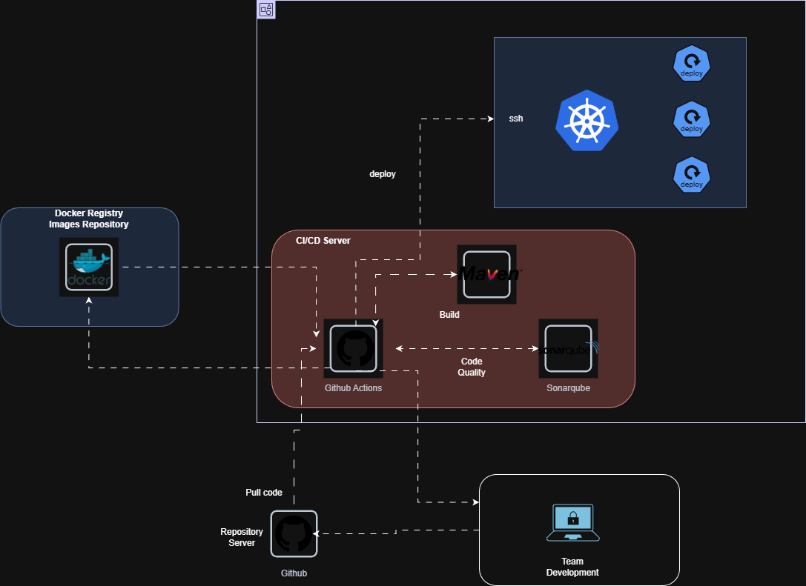
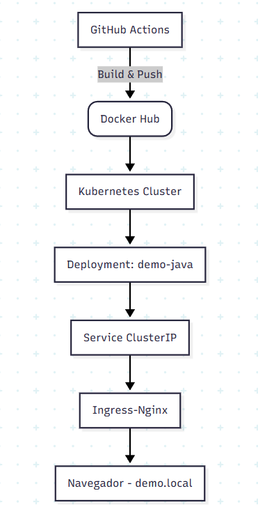

# Demo DevOps Java

Este proyecto es una aplicación Java desarrollada con Spring Boot 3.0.5 y Java 17.
Incluye dockerización, pipeline CI/CD con GitHub Actions, análisis estático, escaneo
de vulnerabilidades, despliegue en Kubernetes y exposición mediante Ingress.

## 📌 Prerequisitos

- Java 17
- Maven 3+
- Docker Desktop con Kubernetes habilitado
- Ingress NGINX

## Diagrama 1: Arquitectura General del Pipeline CI/CD y Entorno de Despliegue
Este diagrama muestra el flujo completo de CI/CD: desde el desarrollo, control de versiones en GitHub, análisis de calidad con SonarQube, construcción del artefacto con Maven, publicación de imágenes en Docker Hub y despliegue automatizado en un clúster Kubernetes.


## Diagrama 2: Flujo de Despliegue de la Aplicación
Este diagrama resume el proceso de build & push de la imagen desde GitHub Actions, seguido del despliegue en Kubernetes utilizando Deployment, Service y Ingress.




## 🚀 Instalación

Clonar repositorio:

```bash
git clone https://github.com/walterbamac/demo-devops-java.git
cd demo-devops-java
```

## ▶️ Ejecutar en local

### Ejecutar pruebas

```bash
mvn clean test
```

### Ejecutar aplicación

```bash
mvn spring-boot:run
```

Abrir Swagger:

```
http://localhost:8080/api/swagger-ui/index.html
```

## 🐳 Docker

### Construir imagen

```bash
docker build -t demo-devops-java .
```

### Ejecutar contenedor

```bash
docker run -p 8080:8080 demo-devops-java
```

## 🔄 CI/CD (GitHub Actions)

Incluye:

- Checkout
- Setup JDK 17
- Build & Test
- SonarCloud
- Jacoco
- Docker build & push
- Trivy scan

Archivo: `.github/workflows/ci-cd.yaml`

## ☸️ Kubernetes Deployment

Manifiestos en:

```
k8s/
 ├── configmap.yaml
 ├── secret.yaml
 ├── service.yaml
 ├── deployment.yaml
 ├── ingress.yaml
 └── hpa.yaml
```

Aplicar:

```bash
kubectl apply -f k8s/
```

## 🌐 Acceso vía Ingress

Agregar al archivo hosts:

```
127.0.0.1 demo.local
```

Acceso:

```
http://demo.local/api/swagger-ui/index.html
```

## 📌 Endpoints

### Crear usuario

`POST /api/users`

```json
{
  "dni": "dni",
  "name": "name"
}
```

### Obtener todos los usuarios

`GET /api/users`

### Obtener usuario por ID

`GET /api/users/{id}`